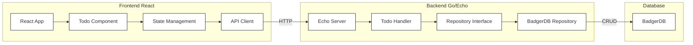
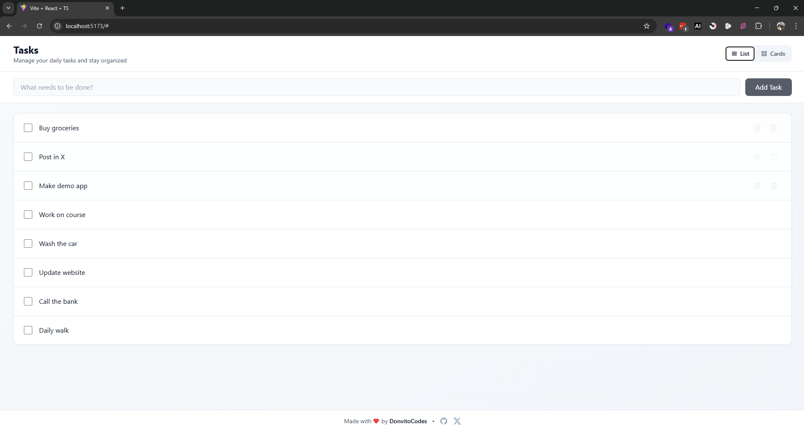
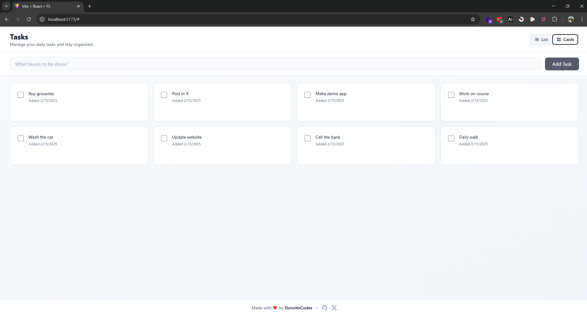

# Cursor React-Go Todo Application

A modern, full-stack Todo application built with React and Go, featuring real-time updates and persistent storage.

This example project was built using [Cursor](https://cursor.sh), the world's best AI-native IDE.

## Architecture



## Screenshots

### List View


### Card View


## Project Structure

- `frontend/`: React TypeScript application
  - Uses React hooks for state management
  - Communicates with backend via REST API
  - Modern UI with real-time updates

- `backend/`: Go Echo server
  - Clean architecture with handlers and repositories
  - BadgerDB for persistent storage
  - RESTful API endpoints
  - CORS enabled for frontend communication

## Features

- Create, Read, Update, and Delete todos
- Persistent storage using BadgerDB
- Real-time updates
- Clean and modern UI
- Type-safe frontend with TypeScript
- Efficient backend with Go

## Technical Stack

- **Frontend**:
  - React
  - TypeScript
  - Modern CSS

- **Backend**:
  - Go
  - Echo framework
  - BadgerDB

## API Endpoints

- `GET /api/todos`: Fetch all todos
- `POST /api/todos`: Create a new todo
- `PUT /api/todos/:id`: Update a todo
- `DELETE /api/todos/:id`: Delete a todo

## Running the Application

### Using Docker (Recommended)

The easiest way to run the application is using Docker. This will run both frontend and backend in a single container.

1. Build the Docker image:
   ```bash
   docker build -t todo-app .
   ```

2. Run the container:
   ```bash
   docker run -p 5173:5173 -p 8080:8080 todo-app
   ```

The application will be available at:
- Frontend: http://localhost:5173
- Backend API: http://localhost:8080

### Manual Setup

If you prefer to run the services separately:

1. Start the backend server:
   ```bash
   cd backend
   go run main.go
   ```

2. Start the frontend development server:
   ```bash
   cd frontend
   npm install
   npm run dev
   ```

## Development

### Prerequisites
- Docker (for containerized setup)
- Go 1.21 or later (for manual backend setup)
- Node.js 20 or later (for manual frontend setup)

### Data Persistence
- The application uses BadgerDB for data storage
- Data is persisted in the `backend/data` directory
- When running in Docker, the data persists within the container

### Environment Variables
- `FRONTEND_URL`: Frontend URL (default: http://localhost:5173)
- `BACKEND_URL`: Backend API URL (default: http://localhost:8080)

## Troubleshooting

### Docker Issues
1. Port conflicts:
   - If ports 5173 or 8080 are in use, modify the port mapping in the docker run command:
   ```bash
   docker run -p <new-frontend-port>:5173 -p <new-backend-port>:8080 todo-app
   ```

2. Data persistence:
   - To persist data outside the container, mount a volume:
   ```bash
   docker run -p 5173:5173 -p 8080:8080 -v $(pwd)/data:/app/backend/data todo-app
   ``` 