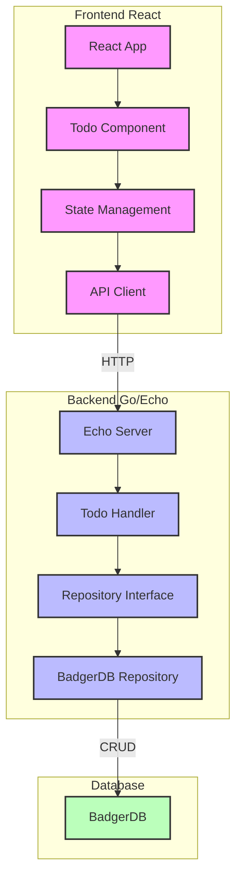

# Cursor React-Go Todo Application

A modern, full-stack Todo application built with React and Go, featuring real-time updates and persistent storage.

## Architecture



## Project Structure

- `frontend/`: React TypeScript application
  - Uses React hooks for state management
  - Communicates with backend via REST API
  - Modern UI with real-time updates

- `backend/`: Go Echo server
  - Clean architecture with handlers and repositories
  - BadgerDB for persistent storage
  - RESTful API endpoints
  - CORS enabled for frontend communication

## Features

- Create, Read, Update, and Delete todos
- Persistent storage using BadgerDB
- Real-time updates
- Clean and modern UI
- Type-safe frontend with TypeScript
- Efficient backend with Go

## Technical Stack

- **Frontend**:
  - React
  - TypeScript
  - Modern CSS

- **Backend**:
  - Go
  - Echo framework
  - BadgerDB

## API Endpoints

- `GET /api/todos`: Fetch all todos
- `POST /api/todos`: Create a new todo
- `PUT /api/todos/:id`: Update a todo
- `DELETE /api/todos/:id`: Delete a todo

## Getting Started

Start the backend server:

```bash
cd backend
go run main.go
```

Start the frontend development server:

```bash
cd frontend
npm install
npm run dev
```

The application will be available at:
- Frontend: http://localhost:5173
- Backend: http://localhost:8080 